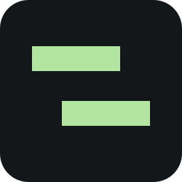
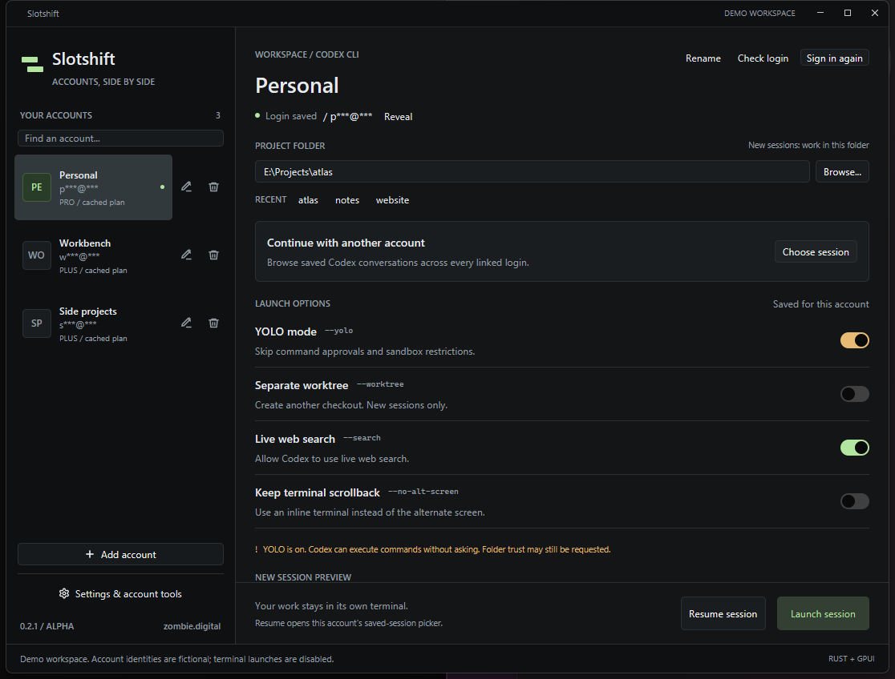
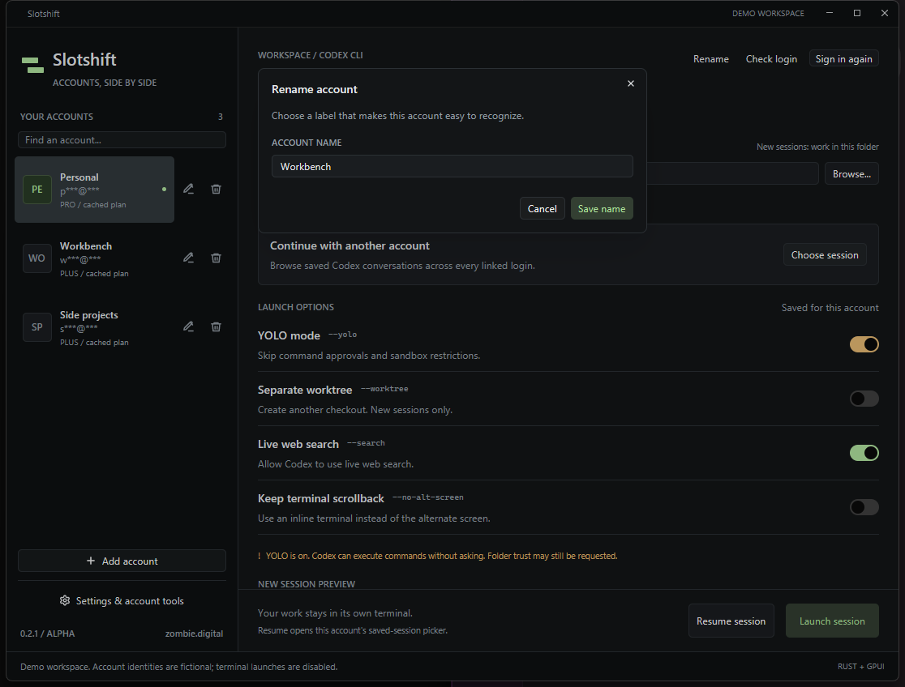
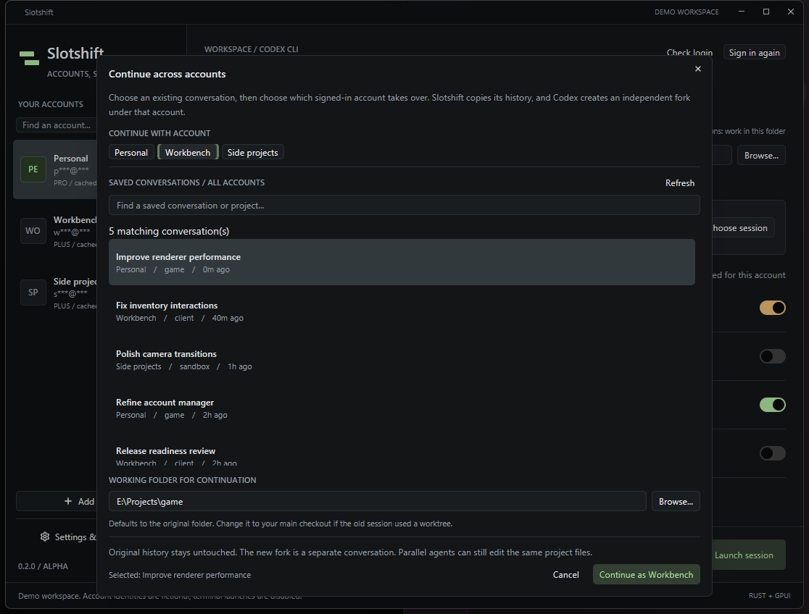

<p align="center"></p>
<h1 align="center">Slotshift</h1>
<p align="center"><strong>Accounts, side by side.</strong><br>A small native launcher for your Codex CLI accounts.</p>
<p align="center"><a href="https://github.com/joenilan/slotshift/releases">Download for Windows</a> · <a href="#getting-started">Getting started</a> · <a href="#build-from-source">Build from source</a></p>



Keep one account working while you start another. Slotshift opens the official Codex CLI in separate terminal windows, with a dedicated Codex home for each account and launch settings you can actually see.

**Windows-first alpha.** Built in Rust with [GPUI Kit](https://gpui-kit.com/). No Electron, embedded browser, API proxy, automatic account rotation, or combined quota pool. Independent software by **zombie.digital**, not affiliated with or endorsed by OpenAI.

## What it does

- **Your account list, not three fixed slots.** Add accounts, search them, or link existing Codex homes. Click the **pencil icon beside any account** to rename its label, or the trash icon to remove its launcher entry with confirmation. Credentials, history, and running sessions remain untouched.
- **New, resumed, and cross-account sessions.** Launch Codex or resume within one account; **Continue with another account** searches saved conversations across your linked Codex homes, copies the required history, and starts an independent fork under another signed-in account without logging out. The original conversation stays intact.
- **Saved options per account.** Toggle YOLO, separate worktrees, live web search, and inline terminal scrollback. The command preview shows what a new session will receive.
- **Local-first account separation.** Separate homes and file credentials for managed accounts. Interactive sessions use `--no-daemon`; unsupported CLI versions stop rather than silently connecting to another account's shared server.
- **A native interface.** GPU rendering, a resizable window, keyboard-accessible controls, system folder pickers, graphite surfaces, and a restrained mint accent.

## Getting started

Download the Windows x64 ZIP from [Releases](https://github.com/joenilan/slotshift/releases), extract it, and open `slotshift.exe`. The alpha executable is **unsigned**; Windows may display a reputation warning. Verify the published SHA-256 checksum before running downloaded software. Do not disable Windows security protections.

You also need the official **Codex CLI**, installed and available on your PC. Slotshift prefers its standalone Windows executable and can find supported npm package layouts. It does not install Codex or update the desktop app. Use **Settings → Choose executable** when automatic detection does not find your standalone `codex.exe`.

1. Click **Add account**, give it a label, and create a new private account home. Alternatively, enable **Link an existing Codex home** to reuse a folder that already contains `config.toml` or `auth.json`.
2. Click **Sign in**. Complete Codex's official browser authorization using the intended account. Finish one sign-in before starting another. **Device sign-in** in Settings is a fallback when supported by your account.
3. Choose the project folder, set your options, then **Launch session**. Select another account and repeat. Closing Slotshift does not close the terminals it opened.

**Renaming an account:** Click its pencil icon in the left sidebar, enter the new name, then choose **Save name**. You can also select it and choose **Rename** in the account header. This only changes Slotshift's display label, never the signed-in account or existing session files.



An existing default `~/.codex` home is discovered automatically. It may also be used by another Codex app, so Slotshift deliberately protects its sign-in from replacement. Manage that default login in Codex itself.

The earlier `codex-accounts` PowerShell launcher's homes are linked **in place** on first startup. No authentication files, session histories, or imported account configs are copied or moved. Its selected account and project are retained, and its previous YOLO default is preserved. The old launcher can remain installed as a fallback.

## Continue work with another account



When one account reaches its usage limit, you can keep its conversation without changing logins:

1. Click **Choose session** under **Continue with another account** on the main page.
2. Search or scroll conversations from **all linked accounts** (the source account is shown beside each title).
3. Choose the conversation and select a **different destination account** at the top.
4. Confirm the **working folder**. It defaults to the original project, but you can browse to the original repository on `main` if the source used a temporary worktree.
5. Click **Continue as [account]**. Codex starts a **new fork** under the selected account's own login and launch preferences.

Slotshift reads local Codex's SQLite session-title index **read-only** and falls back to `session_index.jsonl`. It copies the selected session's saved JSONL history (plus paginated ancestors) into the destination account; it never copies authentication tokens, changes existing sessions, edits the source, or overwrites conflicting destination histories. This is a **fork**, not a shared live thread: subsequent messages diverge, and simultaneous agents in the same working folder can still conflict. Let the source finish its current turn before transferring. A working project folder and a signed-in destination account are required. An older or incompatible Codex history may not be transferable; the app stops with an error instead of modifying the original.

Session titles and account labels remain distinct. Slotshift masks recognizable email addresses in displayed session titles, but other text in titles and project paths can be sensitive during a stream. Custom nicknames should not contain personal information. No account quotas are combined and no requests are proxied.

## Launch options

| Option | On | Off |
|---|---|---|
| YOLO | Adds `--yolo`; skips command approvals and sandboxing. | Explicitly uses `--sandbox workspace-write --ask-for-approval on-request`. |
| Separate worktree | Adds `--worktree` for a **new** session. | Uses your selected folder and its current branch. |
| Live web search | Adds `--search`. | Does not add the live-search override; Codex's own configuration still applies. |
| Keep terminal scrollback | Adds `--no-alt-screen`. | Does not override the default terminal screen behavior. |

Fresh accounts start with **YOLO off** and **worktrees off**. Options affect the next launch or resume, not already-running sessions. Project trust is separate from command approvals, so a trusted-folder prompt can still appear with YOLO enabled. Resume retains the session's original project; it does not move old worktree sessions into another folder.

Agents working in the same project folder share editable files. Slotshift does not switch branches, merge their changes, or coordinate concurrent Git operations.

## Accounts and privacy

**Streaming-friendly identity labels.** Login emails/usernames are masked by default (for example, `p***@***`), separately from your custom account nickname. Click **Reveal** to show only the selected account's identity for 15 seconds; click **Hide** to conceal it sooner. The sidebar stays masked, changing accounts hides the identity, and reveal state never survives an app restart. Hidden addresses are not placed in tooltips or accessibility labels. Use non-sensitive nicknames: this protects login identity labels, not arbitrary project paths, custom names, or Codex's own terminal output.

Settings live in `%LOCALAPPDATA%\Slotshift\settings.json`. New account homes live under `%LOCALAPPDATA%\Slotshift\accounts\<random-id>`. Linked homes remain where they are. The owned data folder is restricted to the current Windows user, SYSTEM, and administrators.

Credentials are stored by Codex, not in a Slotshift password database. For managed accounts, Codex uses each home's **plain-text `auth.json`**. Treat these files as passwords. Cached email, plan, and account identity claims are read locally to label accounts and detect duplicate saved identities; they are **not live subscription or usage verification**. Use `/status` inside Codex for current information.

Removing an entry is **not logout or credential deletion**. Its files remain available for re-import. Account homes and worktrees are organizational boundaries, **not security sandboxes**. In particular, a YOLO session can access other files allowed by your Windows user. The default home can intentionally be shared with other Codex apps.

Slotshift sets account variables only in the new terminal and clears inherited API-key overrides there. It does not modify global environment variables, PowerShell profiles, the system PATH, or imported account configuration. Slotshift sends no telemetry and does not proxy prompts. Codex and your provider retain their own network behavior, terms, and limits.

## Build from source

Use a current stable Rust toolchain (the alpha was built with **Rust 1.99**), Visual Studio C++ build tools, and a Windows SDK. GPUI Kit is pinned to **0.7.1** with its matching GPUI snapshot; `Cargo.lock` is committed.

```powershell
cargo +stable build --release --locked
.\target\release\slotshift.exe
```

```powershell
cargo +stable fmt --all -- --check
cargo +stable test --no-default-features --locked
cargo +stable clippy --all-targets --locked -- -D warnings
```

`--demo` opens a temporary workspace with fictional account labels and **disables real Codex launches**. It is useful for screenshots. `--data-dir <absolute-folder>` uses a separate settings directory and disables automatic discovery of your existing accounts, which is useful for isolated testing.

Core tests cover dynamic account lists, private storage, atomic persistence, legacy migration, credential-safe removal, duplicate identities, command construction, YOLO on/off behavior, Unicode, and PowerShell escaping. The mock CLI in `tests/fixtures` never calls a model or provider. See [validation](docs/VALIDATION.md) for the alpha's actual test scope.

## Local driving and debugging

The source repository and Windows ZIP include a [local UI Automation driver](docs/DRIVING_AND_DEBUGGING.md). It can inspect UI controls, click buttons, enter text, wait for changes, save screenshots, and report process responsiveness. The built-in smoke test launches a disposable **fictional demo**, adds an account, renames it, renames another account, and cancels removal:

```powershell
.\scripts\drive-slotshift.ps1 -Action smoke
```

The release ZIP places `drive-slotshift.ps1` beside `slotshift.exe` rather than in a `scripts` folder. Run the script from that location. The driver has no permanent listener or network bridge. Access to a running real Slotshift instance requires an explicit PID and `-AllowLive`; higher-impact clicks also require `-AllowSensitiveActions`. No tokens are read or included in debug output.

## Scope

This is a launcher, not an embedded terminal, proxy server, remote session host, or quota dashboard. **Cross-account continuation forks locally saved history, not a live process.** It does not move active model turns, share quota, or preserve a process through a PC restart. Resume restores an account's saved Codex conversation; a cross-account fork starts a new saved conversation in the destination profile.

Windows x64 is the tested release target. macOS/Linux terminal adapters and signing are not part of this alpha. The GPU framework does not make Codex's model generation faster.

MIT-licensed application source. See [third-party notices](THIRD_PARTY_NOTICES.md), [security](SECURITY.md), and [contributing](CONTRIBUTING.md).